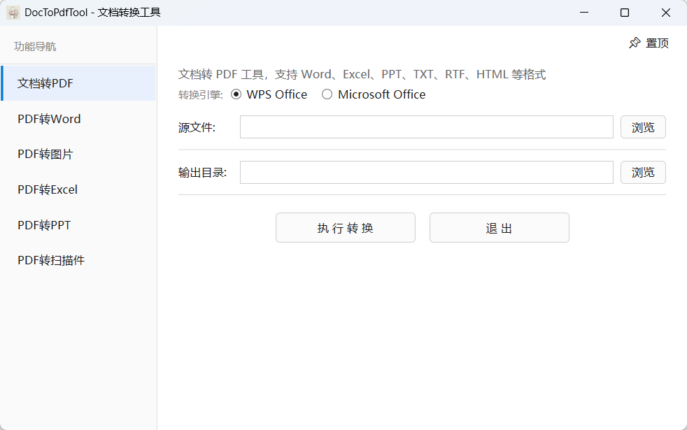

# DocToPdfTool

多功能文档格式转换工具，支持 **文档转 PDF**、**PDF 转 Word**、**PDF 转 Excel**、**PDF 转 PPT**、**PDF 转图片** 和 **PDF 转扫描件** 等多种转换功能。



## 功能

### 文档转 PDF
- **双引擎转换**：支持 WPS Office 和 Microsoft Office 两种转换引擎，运行时自由切换
- **格式支持**：Word（.doc/.docx）、Excel（.xls/.xlsx）、PPT（.ppt/.pptx）、文本（.txt/.rtf）、HTML（.html/.htm/.mhtml）
- **HTML 转换**：基于 Edge 浏览器 headless 模式，保留原始布局和样式
- **Excel 多工作表**：自动列宽适配、分页控制，完整转换所有工作表

### PDF 转 Word
- **Microsoft Word 引擎**：基于 Word COM 自动化，将 PDF 转换为 .docx 格式
- **批量转换**：支持同时添加多个 PDF 文件，逐个转换
- **拖拽添加**：支持拖拽 PDF 文件到列表
- **自动窗口隐藏**：后台静默运行 Word，自动隐藏 Word 窗口

### PDF 转 Excel
- **PdfPig 解析引擎**：基于 PdfPig 开源 PDF 文本提取库，不依赖 Office 组件
- **表格自动识别**：智能检测页面的表格结构，自动识别列边界和表头
- **文本换行合并**：自动合并因单元格内文本换行而被拆分的行，还原表格原始结构
- **页眉页脚过滤**：自动去除 PDF 页面的页眉页脚干扰内容
- **非表格降级**：非表格页面自动降级为文本行输出，避免数据丢失
- **多页支持**：多页 PDF 每页生成独立 Sheet，单页则输出为 Sheet1
- **Excel 原生写入**：纯 XML 方式生成 `.xlsx` 文件，无需 Excel 或任何 Office 组件
- **拖拽添加**：支持拖拽 PDF 文件到列表

### PDF 转 PPT
- **Windows 内置引擎**：基于 Windows 10/11 内置 PDF 渲染引擎（`Windows.Data.Pdf`），无需额外安装软件
- **图片转 PPT**：将 PDF 每页渲染为图片后嵌入 PPTX 幻灯片，保持原始排版
- **批量转换**：支持同时添加多个 PDF 文件，每个文件生成独立 PPTX
- **拖拽添加**：支持拖拽 PDF 文件到列表
- **零依赖**：不依赖 pdfium.dll、Ghostscript 或 Office 组件
- **兼容性好**：生成的 PPTX 在 WPS 和 Microsoft Office PowerPoint 中均可正常打开

### PDF 转图片
- **Windows 内置引擎**：基于 Windows 10/11 内置 PDF 渲染引擎（`Windows.Data.Pdf`），无需额外安装软件
- **批量转换**：支持同时添加多个 PDF 文件，每页生成一张图片
- **拖拽添加**：支持拖拽 PDF 文件到列表
- **可调参数**：支持 DPI（150/300/600）、缩放倍率（1×~5×）、输出格式（JPG/PNG）
- **零依赖**：不依赖 pdfium.dll、Ghostscript 或 Office 组件

### PDF 转扫描件
- **Windows 内置引擎**：基于 Windows 10/11 内置 PDF 渲染引擎（`Windows.Data.Pdf`），无需额外安装软件
- **图片型 PDF**：将 PDF 每页渲染为图片后嵌入新 PDF，文字不可选取编辑
- **批量转换**：支持同时添加多个 PDF 文件，每个文件生成独立扫描件 PDF
- **拖拽添加**：支持拖拽 PDF 文件到列表
- **零依赖**：纯 .NET 写入 PDF，无需 pdfium.dll、Ghostscript 或 Office 组件

## 使用

### 文档转 PDF
1. 选择源文件（支持多格式筛选）
2. 设置输出目录（默认与源文件同目录）
3. 选择转换引擎（WPS Office / Microsoft Office）
4. 点击「执行转换」
5. 转换成功后自动打开输出目录

### PDF 转 Word
1. 点击左侧「PDF转Word」切换到 PDF 转 Word 界面
2. 点击「添加PDF文件」或拖拽 PDF 文件到列表
3. 点击「转换为 Word」
4. 转换完成后自动打开输出目录（桌面/PDF转Word输出）

### PDF 转 Excel
1. 点击左侧「PDF转Excel」切换到 PDF 转 Excel 界面
2. 点击「添加PDF文件」或拖拽 PDF 文件到列表
3. 点击「转换为 Excel」
4. 转换完成后自动打开输出目录（桌面/PDF转Excel输出）

### PDF 转 PPT
1. 点击左侧「PDF转PPT」切换到 PDF 转 PPT 界面
2. 点击「添加PDF文件」或拖拽 PDF 文件到列表
3. 点击「转换为 PPT」
4. 转换完成后自动打开输出目录（桌面/PDF转PPT输出）

### PDF 转图片
1. 点击左侧「PDF转图片」切换到 PDF 转图片界面
2. 点击「添加PDF文件」或拖拽 PDF 文件到列表
3. 设置缩放倍率、输出格式、DPI（可选，默认值即可获得清晰图片）
4. 点击「转换为图片」
5. 转换完成后自动打开输出目录（桌面/PDF转图片输出）

### PDF 转扫描件
1. 点击左侧「PDF转扫描件」切换到 PDF 转扫描件界面
2. 点击「添加PDF文件」或拖拽 PDF 文件到列表
3. 点击「转换为扫描件」
4. 转换完成后自动打开输出目录（桌面/PDF转扫描件输出）

## 构建

### Release 构建
```bash
dotnet build -c Release
```

### 单文件发布
```bash
publish_single.bat
```

输出在 `publish\SingleFile\DocToPdfTool.exe`

## 技术栈

- .NET Framework 4.8 / WPF
- COM 自动化（WPS / Office 后期绑定）
- Edge Chromium headless（HTML 转 PDF）
- Word COM 自动化（PDF 转 Word，3 层回退创建真实 Word 实例）
- PdfPig 开源 PDF 文本提取（PDF 转 Excel，无需 Office 组件）
- 纯 XML xlsx 生成（`ZipArchive` + `XElement`，零 Office 依赖）
- Win32 API 窗口守卫（抑制 Office 弹窗）
- WMI 进程监控 + WinEventHook（Word 窗口自动隐藏）
- Windows.Data.Pdf 内置 PDF 渲染引擎（PDF 转图片/PPT/扫描件，Windows 10+）
- 纯 XML pptx 生成（`ZipArchive` + `XElement`，图片嵌入幻灯片，零 Office 依赖）
- 纯 .NET PDF 写入（`BinaryWriter` + PDF 规范，零依赖嵌入 JPEG 图片）
- Costura.Fody（单文件打包）

## 致谢

本项目的 WPS Office 转换能力参考了 [WPSToPDF](https://github.com/lm3515/WPSToPDF)；Microsoft Office 转换部分参考了 [Pdfor](https://github.com/Vit-Lib/Pdfor)。感谢这些项目提供的灵感和参考。